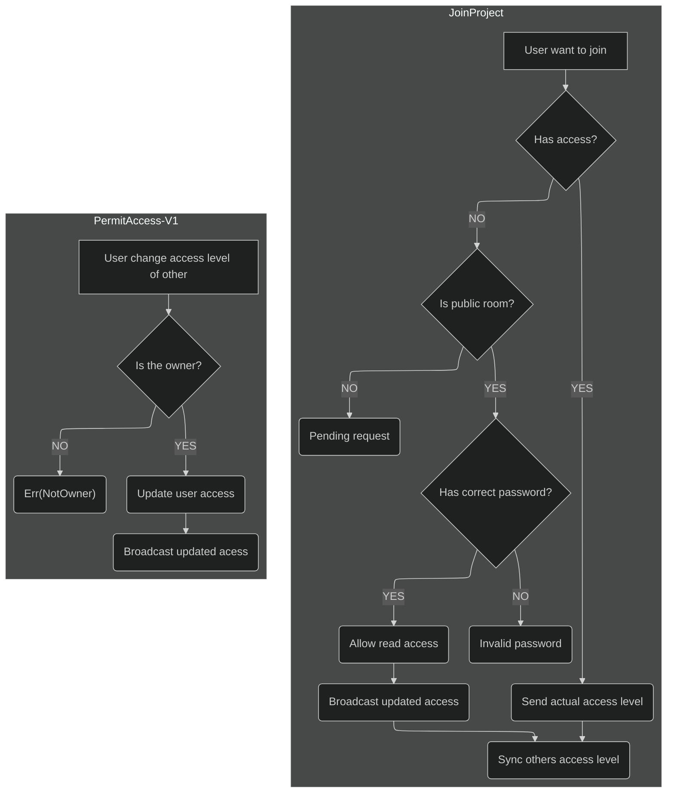

si quieres ver los logs puedes usar

`RUST_LOG=trace`

level is the maximum log::Level to be shown and includes:
    error
    warn
    info
    debug
    trace
    off (pseudo level to disable all logging for the target)
suelo usar:
`RUST_LOG=debug cargo run --bin backend`
Para ejecutar los tests de integracion ejecute la api primero y luego
```
cargo run --bin backend
```
para ejecutar los tests
```
cargo test --test integration_test
```

## Things to know
The prefix `Rg` (Ej. `RgWebsocket`) means for `RsGround`, a way to difference business structs

## Websocket workflow

